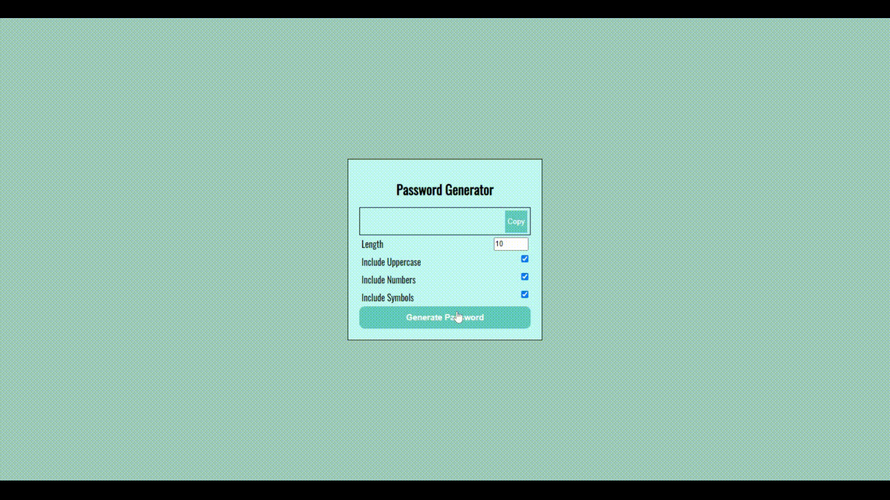

# Random Password Generator

Welcome to the Random Password Generator web application! This application allows users to generate secure and random passwords based on customizable criteria such as length, character types, and more.

## Features

- **Customizable Password Length**: Specify the desired length of your password.
- **Character Set Options**: Include or exclude uppercase letters, lowercase letters, numbers, and special characters.
- **User-Friendly Interface**: Easy-to-use interface for quick password generation.
- **Copy to Clipboard**: Conveniently copy the generated password to your clipboard with a single click.

## Demo

Click Here: [Password Generator Demo](https://getyourpasswords.netlify.app/)

## Usage

1. Open the web application in your browser.
2. Use the controls to set your desired password criteria:
    - **Length**: Use the slider or input box to set the password length.
    - **Character Types**: Check or uncheck options for uppercase letters, lowercase letters, numbers, and special characters.
3. Click the "Generate Password" button.
4. Your randomly generated password will be displayed. You can copy it to your clipboard using the "Copy" button.

---

Happy password generating! 🎉
